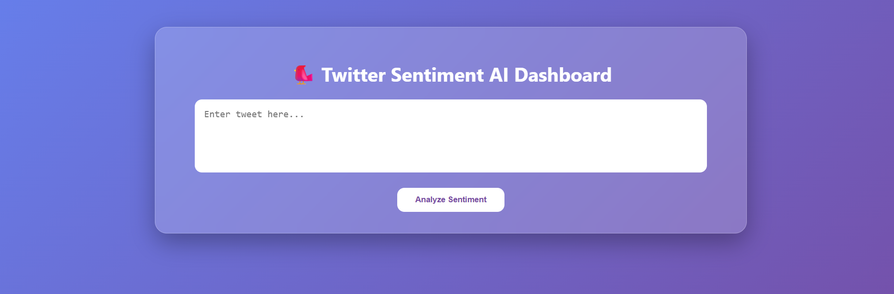
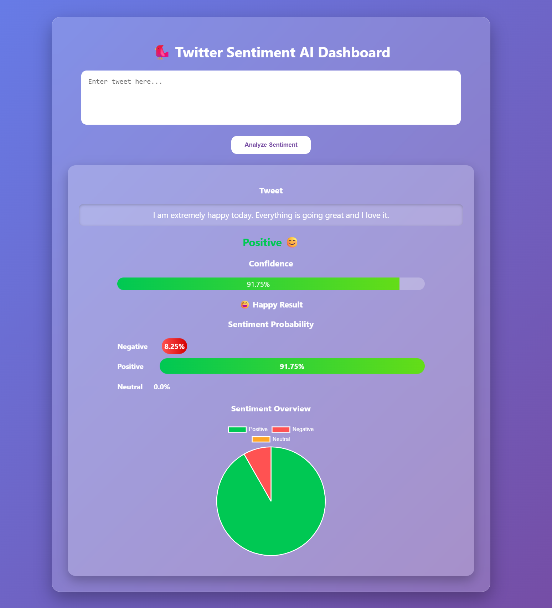
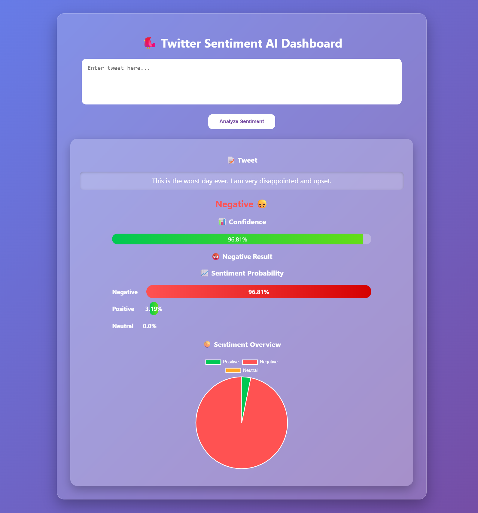

# 🐦 Twitter Sentiment Analysis AI Dashboard

A Machine Learning and Flask-based web application that analyzes tweets and predicts whether the sentiment is **Positive 😊, Negative 😞, or Neutral 😐**. The application uses **TF-IDF Vectorization** and a trained Machine Learning model to classify text and visualize sentiment probabilities through an interactive dashboard.

---

## 🚀 Features

✅ Tweet Sentiment Prediction
✅ Positive, Negative, and Neutral Classification
✅ Confidence Score Display
✅ Sentiment Probability Bars
✅ Interactive Pie Chart Visualization
✅ Modern Glassmorphism UI Design
✅ Flask Web Application
✅ Real-Time Prediction Results

---

## 🛠️ Tech Stack

### Backend

* Python
* Flask
* Scikit-learn
* Pickle

### Machine Learning

* TF-IDF Vectorization
* Logistic Regression / Trained Sentiment Model

### Frontend

* HTML5
* CSS3
* JavaScript
* Chart.js

---

## 📸 Screenshots

### 🏠 Home Page



### 😊 Positive Prediction



### 😞 Negative Prediction



---

## 📂 Project Structure

```text
Twitter_Sentiment_Analysis/
│
├── app.py
├── train_model.py
├── requirements.txt
├── .gitignore
│
├── models/
│   ├── model.pkl
│   └── vectorizer.pkl
│
├── templates/
│   └── index.html
│
├── static/
│   └── style.css
│
├── screenshots/
│   ├── home_page.png
│   ├── positive_result.png
│   └── negative_result.png
│   
│
└── README.md
```

---

## ⚙️ Installation & Setup

### 1️⃣ Clone the Repository

```bash
git clone https://github.com/Nithya200505/Twitter_Sentiment_Analysis.git
```

### 2️⃣ Navigate to the Project Folder

```bash
cd Twitter_Sentiment_Analysis
```

### 3️⃣ Install Dependencies

```bash
pip install -r requirements.txt
```

### 4️⃣ Run the Application

```bash
python app.py
```

### 5️⃣ Open in Browser

```text
http://127.0.0.1:5000
```

---

## 📊 Example Predictions

| Tweet                           | Prediction  |
| ------------------------------- | ----------- |
| I love this movie!              | Positive 😊 |
| This is the worst service ever. | Negative 😞 |
| Today is Monday.                | Neutral 😐  |

---

## 🎯 Machine Learning Workflow

1. Data Collection
2. Text Preprocessing
3. TF-IDF Vectorization
4. Model Training
5. Model Serialization using Pickle
6. Flask Deployment
7. Sentiment Visualization

---

## 🌟 Future Improvements

* User Authentication
* Tweet History Storage
* Live Twitter/X API Integration
* Deep Learning Models (LSTM/BERT)
* Word Cloud Visualization
* Dark/Light Theme Toggle
* Sentiment Trends Analytics

---

## 👩‍💻 Author

**Narayandas Nithyasri**

GitHub: https://github.com/Nithya200505

---

## ⭐ Support

If you found this project useful, consider giving it a ⭐ on GitHub.
